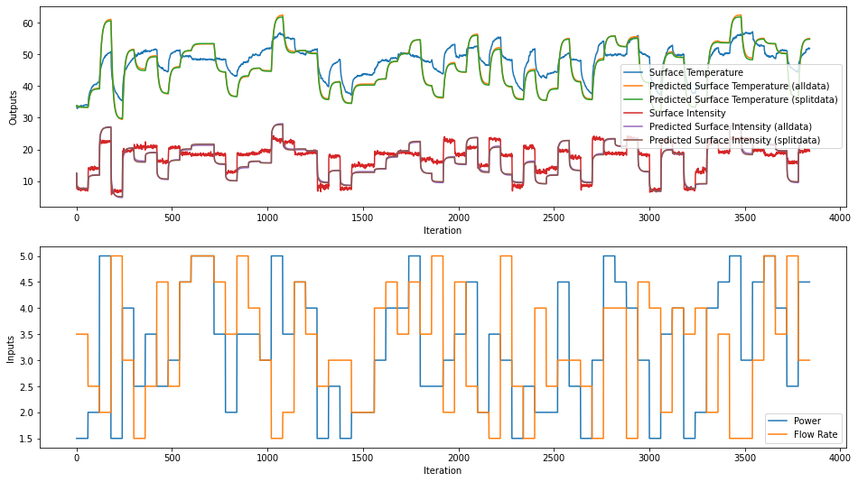
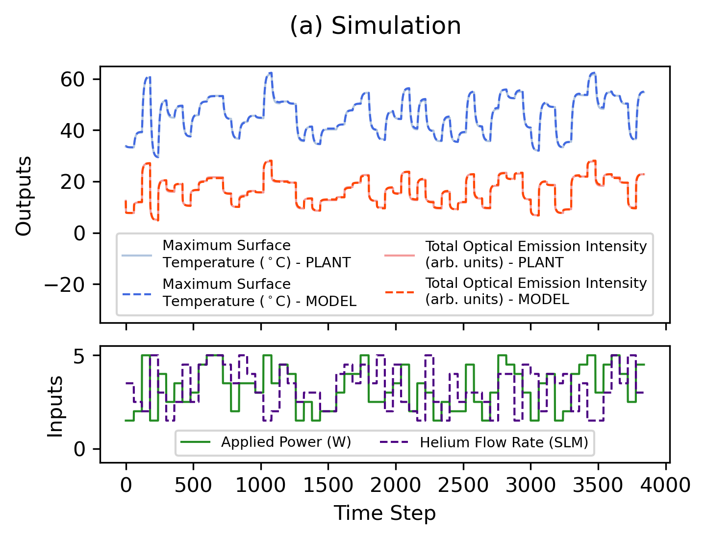
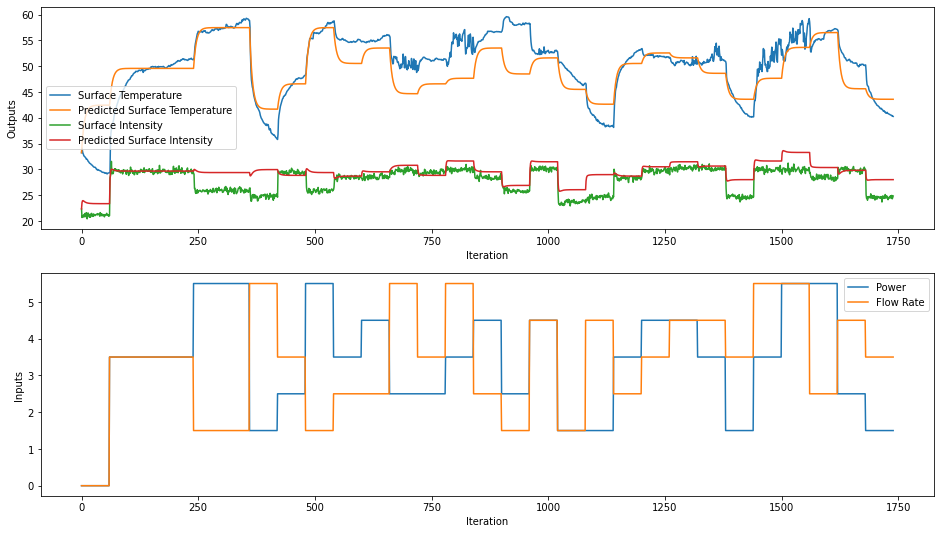
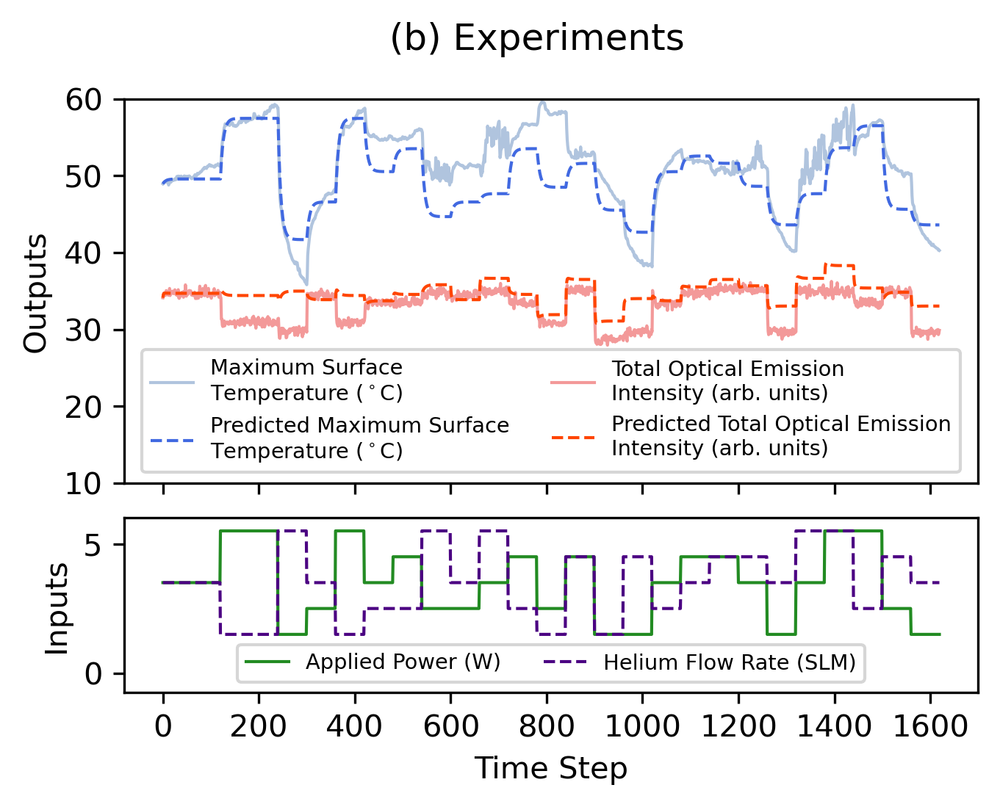

# System Identification for Linear Time-Invariant Models

The code and data located in this folder were used in generating linear time-invariant (LTI) models for use in simulations and as models for controller creation.

Models were fit using `n4sid` (or `ssest`) from MATLAB's System Identification Toolbox. Data were collected as input-output data from the Mesbah Lab Atmospheric Pressure Plasma Jet (APPJ) testbed.

## File Descriptions
* `images` - folder containing saved images for this README
* `2021_06_08_15h57m55s_dataCollectionOL.csv` - input-output (open-loop) data collected on 2021_06_08_15h57m55s
* `APPJmodel_2021_06_08_15h57m55s_n4sid_50split.mat` - LTI model generated using 50% of the data in `2021_06_08_15h57m55s_dataCollectionOL.csv` <-- this was the model that was used as the "plant" in the closed-loop simulations
* `APPJmodel_2021_06_08_15h57m55s_n4sid_alldata.mat` - LTI model generated using 100% of the data in `2021_06_08_15h57m55s_dataCollectionOL.csv` <-- this was the model that was used as the "controller model" in the closed-loop simulations
* `APPJmodel_2022_07_22_11h40m51s.mat` - LTI model generated using the data in `exp_src/ExperimentalData/2022_07_22_11h40m51s/OL_data_0_inputOutputData.csv` <-- this was the model that was used as the "controller model" in the real-time experiments
* `data_view.ipynb` - Python notebook that can be used to read and visualize the data as well as visualize the model predictions
* `README.md` - this file
* `systemID.m` - MATLAB file that is used to fit the models and create the LTI model(s)

## Closed-loop Simulations
Closed-loop simulations were performed by using two LTI models learned from the same data collection. The "plant" model had the following system matrices:
$$
A = \begin{bmatrix}
0.8875 & 0.0546 \\
0.0935 & 0.2827 \\
\end{bmatrix}, ~~ B = \begin{bmatrix}
0.5028 & -0.1740 \\
2.7637 & -1.0366 \\
\end{bmatrix}
$$
The control model had the following system matrices:
$$
A = \begin{bmatrix}
0.9027 & 0.0175 \\
0.1316 & 0.2426 \\
\end{bmatrix}, ~~ B = \begin{bmatrix}
0.5815 & -0.2204 \\
2.6737 & -1.1310 \\
\end{bmatrix}
$$

## Real-time Experiments
Real-time experiments were performed by using one LTI model fit from data collected before proceeding with Bayesian optimization experiments. The control model had the following system matrices:
$$
A = \begin{bmatrix}
0.8451 & 0.0163 \\
-0.0604 & 0.3584 \\
\end{bmatrix}, ~~ B = \begin{bmatrix}
0.4497 & -0.1639 \\
0.7128 & 0.5668 \\
\end{bmatrix}
$$

