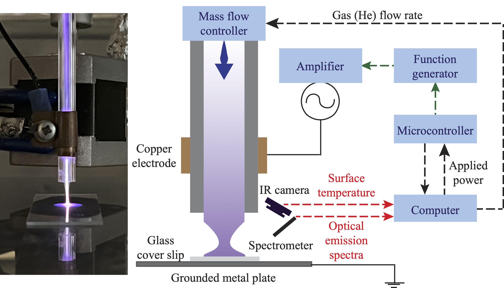
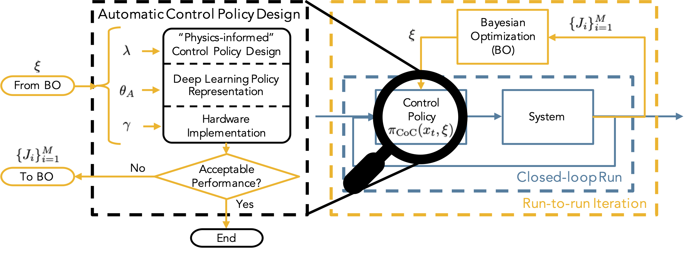

# Real-time Experiments

**NOTE: The documentation for this code is currently under revision, and the code may be simplified for a general audience. This repository will be finalized by the publication date of this work.**

**NOTE: This code is provided to reproduce the results obtained in the following paper: "A Practical Multi-Objective Learning Framework for Optimal Hardware-Software Co-Design of Control-on-a-Chip Systems". Please see the README of the main working directory of [this repository](https://github.com/Mesbah-Lab-UCB/HW-SW_CoDesign4CoC) for a reference to the paper and for preliminary information regarding this code.**

## Source Code
This is considered the main working directory to run the code for the **real-time experiments** of the control-on-a-chip (CoC) design framework.

Briefly, the CoC design workflow is described as shown in the dashed black box where a "physics-informed" policy is generated, then a deep learning representation is generated to approximate the "physics-informed" policy, and finally, the deep learning representation is implemented in hardware. After a full CoC policy has been designed, hardware-in-the-loop simulations (or experiments) can be performed to obtain closed-loop performance metric(s). Those metrics can be fed into Bayesian optimization (BO) that can then suggest new CoC design parameters to try next. Here, the tuning is performed all at once versus the standard stepwise verification. 

## Folder Descriptions
This section briefly describes the purpose of each of the *folders* nested within this directory.
* `codegen` - automatically-generated file when MATLAB creates a code generation
* `codegen_helpers` - helper functions for use with codegen
* `codegen0_H5_L2_wL13_UnrollLoops`, `codegen0_H5_L3_wL20_LoopNone`, and `codegen0_H8_L2_wL18_LoopNone` - copies of the codegen directory after a particular set of parameters are used; code must be generated, then programmed onto the FPGA, and then the FPGA-in-the-loop experiment is performed. These folders facilitate faster experimental procedure (avoids waiting for the code to regenerate with the same set of parameters)
* `config` - contains files that determine the configuration of the system, important for describing the problem formulation of the case study; this folder will contain the problem configurations for the APPJ test system
* `data` - 
* `Experimental Data` - raw data collected from the APPJ testbed
* `experiments` - folder used to store closed-loop data during sequential optimization
* `fxp_codegen` - folder that contains the fixed-point code generation files (an intermediate step in HDL code generation)
* `hdlcoder_fullDNN` - folder that contains the HDL Coder project for HDL code generation
* `saved` - saved files for intermediate results; includes the hardware classifier data and classifier evaluation object
* `utils` - contains the custom helper code for this project; the main focus of the work is on a policy search routine using Bayesian optimization (BO), so the ancillary portions of the work (e.g., MPC formulation, neural network building and training, etc.) are placed in helper files.

## Other Files
This section briefly describes other files that are located within this main working directory.
* `appj_warmup.py` - Python script to warm-up the APPJ by running the APPJ at set parameters for 15 minutes
* `APPJmodel_2022_07_15_14h12m27s_v2.mat` - model matrices 
* `approx_msMPC_HIL.m` - wrapper MATLAB function called by Python to run the CoC design process in MATLAB <-- `run_mobo_hw_ax.py` calls this function to evaluate the closed-loop performance metrics of the CoC design
* `exp_data_agg.py` - Python script to aggregate and plot data obtained from real-time experimental runs on the APPJ testbed (for use in generating the training dataset for DNN approximation) 
* `gen_exp_projects.py` - Python script to generate the code for the FPGA-based control policies for use in real-time experiments
* `generate_dnn_data.m` - wrapper MATLAB function to generate training data for a DNN approximation to an MPC <-- this is for offline training data, i.e., using simulated data versus data from real-time experiments
* `initialize_dnn.m` - wrapper MATLAB function to create a DNN-based control policy (implemented on CPU) from Python; for use in real-time experiments
* `initialize_fpga_ctrl.m` - wrapper MATLAB function to create a control policy on hardware (FPGA) from Python; for use in real-time experiments
* `initialize_msmpc.m` - wrapper MATLAB function to create a multi-stage (or scenario-based) MPC from Python; for use in real-time experiments
* `plotExpData.py` - Python script to generate figures of the experimental data
* `print_ctime.py` - Python script to print the computational times encountered during real-time experiments
* `README.md` - this document
* `remove_codegen_project.m` - wrapper MATLAB function called by Python to remove the codegen files and avoid an overwrite prompt; file paths are currently hard-coded
* `run_cl_exp.m` - main Python script to run closed-loop experiments with the APPJ testbed (should be modified for different configurations of controllers)
* `run_mobo_hw_ax.py` - main Python script to run MOBO
* `spectroscipyLive.py` - Python script to test functionality of the spectrometer

## Results
*to be added upon publication*
