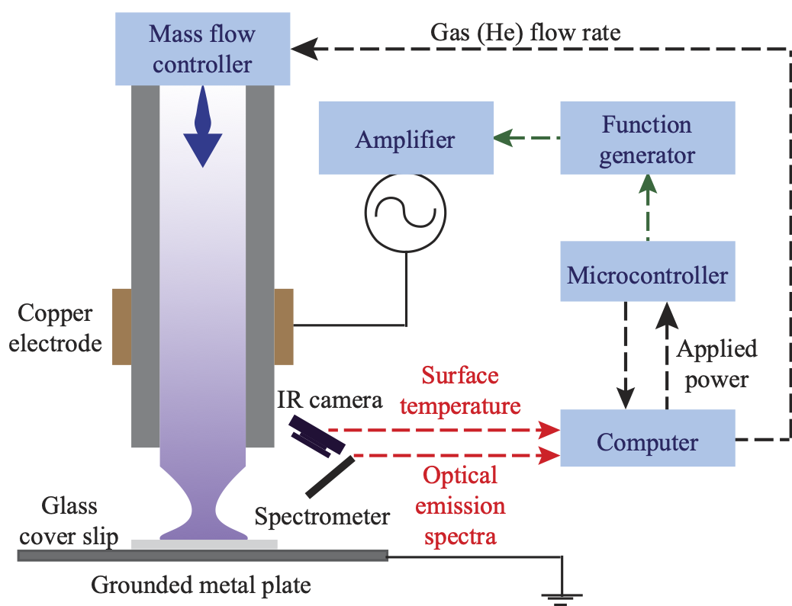
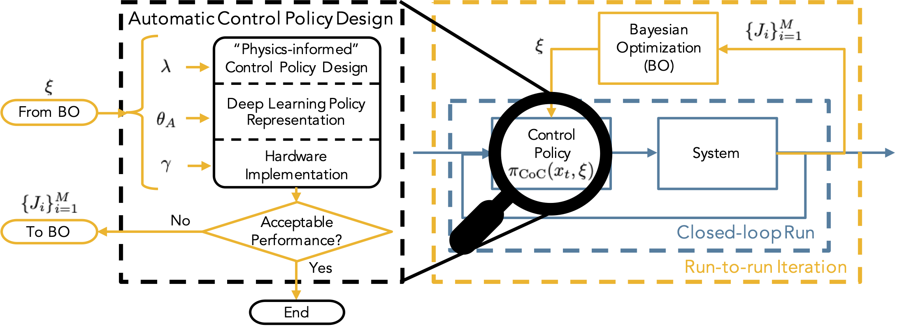
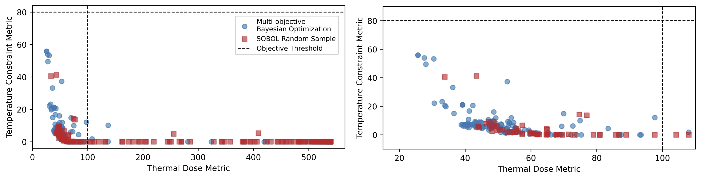
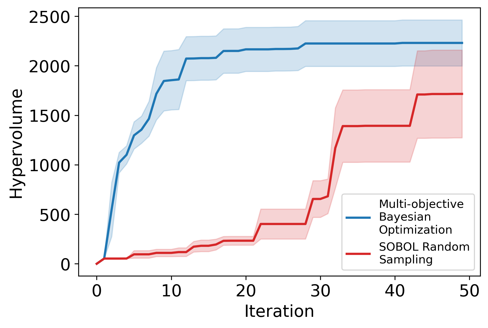

# Closed-loop Simulations

**NOTE: The documentation for this code is currently under revision, and the code may be simplified for a general audience. This repository will be finalized by the publication date of this work.**

**NOTE: This code is provided to reproduce the results obtained in the following paper: "A Practical Multi-Objective Learning Framework for Optimal Hardware-Software Co-Design of Control-on-a-Chip Systems". Please see the README of the main working directory of [this repository](https://github.com/Mesbah-Lab-UCB/HW-SW_CoDesign4CoC) for a reference to the paper and for preliminary information regarding this code.**

## Source Code
This is considered the main working directory to run the code for the **closed-loop simulations** of the control-on-a-chip (CoC) design framework.

Briefly, the CoC design workflow is described as shown in the dashed black box where a "physics-informed" policy is generated, then a deep learning representation is generated to approximate the "physics-informed" policy, and finally, the deep learning representation is implemented in hardware. After a full CoC policy has been designed, hardware-in-the-loop simulations (or experiments) can be performed to obtain closed-loop performance metric(s). Those metrics can be fed into Bayesian optimization (BO) that can then suggest new CoC design parameters to try next. Here, the tuning is performed all at once versus the standard stepwise verification. 

## Folder Descriptions
This section briefly describes the purpose of each of the *folders* nested within this directory.
* `codegen` - automatically-generated file when MATLAB creates a code generation
* `codegen_helpers` - helper functions for use with codegen
* `config` - contains files that determine the configuration of the system, important for describing the problem formulation of the case study; this folder will contain the problem configurations for the APPJ test system
* `experiments` - folder used to store closed-loop data during sequential optimization
* `fxp_codegen` - folder that contains the fixed-point code generation files (an intermediate step in HDL code generation)
* `hdlcoder_fullDNN` - folder that contains the HDL Coder project for HDL code generation
* `images` - folder containing saved images for this README
* `saved` - saved files for intermediate results; includes the hardware classifier data and classifier evaluation object
* `utils` - contains the custom helper code for this project; the main focus of the work is on a policy search routine using Bayesian optimization (BO), so the ancillary portions of the work (e.g., MPC formulation, neural network building and training, etc.) are placed in helper files.

## Other Files
This section briefly describes other files that are located within this main working directory.

* `approx_msMPC_HIL.m` - wrapper MATLAB function called by Python to run the CoC design process in MATLAB <-- `run_mobo_hw_ax.py` calls this function to evaluate the closed-loop performance metrics of the CoC design
* `generate_dnn_data.m` - wrapper MATLAB function to generate training data for a DNN approximation to an MPC
* `hw_classifier.m` - MATLAB script to train and save the hardware classifier using data generated from `run_classifier_data_gen.m`; the script will save a CasADi function-based implementation of the classifier, which will evaluate faster than the built-in predict method
* `hw_constraint4python.m` - wrapper MATLAB function called by Python to evaluate the hardware constraint classifier
* `README.md` - this document
* `remove_codegen_project.m` - wrapper MATLAB function called by Python to remove the codegen files and avoid an overwrite prompt; file paths are currently hard-coded
* `run_classifier_data_gen.m` - MATLAB script to generate the training data for the hardware classifier
* `run_mobo_hw_ax.py` - main Python script to run MOBO

## Results
*to be added upon publication*
<!-- 

 -->
