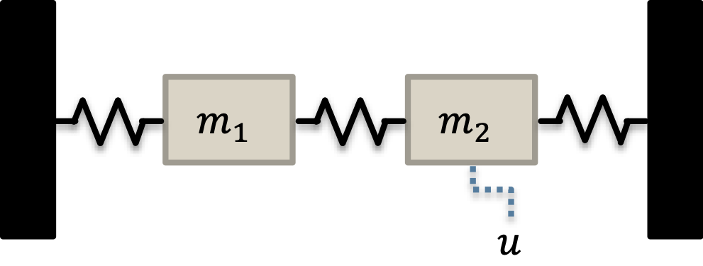

# Illustrative Example

**NOTE: The documentation for this code is currently under revision, and the code may be simplified for a general audience. This repository will be finalized by the publication date of this work.**

**NOTE: This code is provided to reproduce the results obtained in the following paper: "A Practical Multi-Objective Learning Framework for Optimal Hardware-Software Co-Design of Control-on-a-Chip Systems". Please see the README of the main working directory of [this repository](https://github.com/Mesbah-Lab-UCB/HW-SW_CoDesign4CoC) for a reference to the paper and for preliminary information regarding this code.**

## Source Code
This is considered the main working directory to run the code for the illustrative example presented in the paper. 



Briefly, the illustrative example compared the computational differences between different control policies to illustrate the challenges encountered when embedding control policies on hardware. The control policies compared were model predictive control (MPC), explicit MPC (EMPC), and a deep neural network representation of the MPC (DNN). When implemented on hardware, MPC is defined as the evaluation of the implicit control law defined by an optimization problem, i.e., the online evaluation of MPC equates to the implicit solution of an optimal control problem. EMPC is defined as the evaluation of a lookup table of gains that were precomputed via the solution of a multiparametric programming problem that approximately equates to the evaluation of MPC. DNN is defined as the forward pass/evaluation of a fully-connected, feedforward neural network that was trained on input-output data generated through evaluation of the optimal control problem.

The main file to run the comparison and evaluate the metrics is `run_cl_metrics.m`, which assumes that each control policy has been generated into C-code and precompiled into a `MEX` function. The details on how this is done is detailed below. The computational time and stage cost data collected by running this script was used to generate Table I.

## Code Generation of Control Policies

### Model Predictive Control (MPC)
The MPC was defined in [CasADi](https://web.casadi.org), which is a well-known package for implementing optimal control problems by taking advantage of automatic differentiation techniques. 

Code generation procedure:
1. The optimal control problem is formulated using CasADi's symbolic framework.
2. The optimal control problem is converted to an implicit representation of the control law of the form $u_t^\star = \pi_{mpc}(x_t)$.
3. The functional form $\pi_{mpc}$ is called with the `generate()` function to create a C-code representation. The arguments of `generate()` are a filename to which the C-code is stored and the options for code generation. The options used in this work are defined in a MATLAB structure `opts`
    * 'main': true
    * 'mex': true
    * 'with_header': true
4. The C-code is converted to a MEX function with the following MATLAB command line command:
```matlab
mex filename -largeArrayDims -outdir codegen/mex/mpc/ -output mpc_mex
```
5. The final MEX function is used in a MATLAB script (`run_cl_metrics.m`) to compare the different control policies.

### Explicit Model Predictive Control (EMPC)
The EMPC strategy was defined using a third-party MATLAB toolbox, [MPT-3](https://www.mpt3.org), which is well-known for its capabilities in implementing MPC strategies.

Code generation procedure:
1. The optimal control problem is formulated using MPT-3's `MPCController`, which gives an implicit representation of the control law of the form $u_t^\star = \pi_{mpc}(x_t)$.
```matlab
c = MPCController(system, horizon);
```

2. The optimal control problem is converted to an explicit representation an implicit representation with `toExplicit()`.
```matlab
ec = c.toExplicit();
```

3. A functional form $u_t^\star = \pi_{empc}(x_t)$ of the EMPC is generated with
```matlab
ec.toMatlab(mfile, 'primal', 'obj');
```
where `mfile` is the filename of the m-code representation of $u_t^\star = \pi_{empc}(x_t)$. The explicit version will search for the appropriate gain from the piecewise affine function that defines $u_t^\star = \pi_{empc}(x_t)$.

4. The C-code is converted to a MEX function with the following MATLAB command line command:
```matlab
coder mfile -args {zeros(nx, 1)};
```
5. The final MEX function is used in a MATLAB script (`run_cl_metrics.m`) to compare the different control policies.

### Deep Neural Network-based Approximate Model Predictive Control (DNN)
The DNN was generated via the `feedforwardnet` function of MATLAB's Deep Learning Toolbox.

Code generation procedure:
1. A deep neural network is trained using `feedforwardnet` from the Deep Learning toolbox and data generated by solving the implicit optimal control problem from MPC for various $x_t$.

2. The trained neural network object is converted to an m-function representation to yield a functional representation of the control policy $u_t^\star = \pi_{dnn}(x_t)$ that can be converted to C-code.
```matlab
genFunction(net, mfile, 'MatrixOnly', 'yes');
```
where `net` is the trained neural network object and `mfile` is the filename of the m-code representation of $u_t^\star = \pi_{dnn}(x_t)$.

3. The C-code is converted to a MEX function with the following MATLAB command line command:
```matlab
coder mfile -args {zeros(nx, 1)};
```
4. The final MEX function is used in a MATLAB script (`run_cl_metrics.m`) to compare the different control policies.

## Folder Descriptions
This section briefly describes the purpose of each of the *folders* nested within this directory.
* `config` - contains files that determine the configuration of the system, important for describing the problem formulation of the case study; this folder will contain the problem configurations for the two mass system as well as a general six-mass system
* `DNN` - contains files that create the DNN control policy for embedded implementation
* `EMPC` - contains files that create the EMPC policy for embedded implementation
* `Figures` - contains `*.fig` files generated from `run_cl_metrics.m`
* `images` - folder containing saved images for this README
* `MPC` - contains files that create the MPC policy for embedded implementation
* `utils` - contains the custom helper code for this project; the main focus of the work is on a policy search routine using Bayesian optimization (BO), so the ancillary portions of the work (e.g., MPC formulation, neural network building and training, etc.) are placed in helper files.

## Other Files
This section briefly describes other files that are located within this main working directory.
* `empc_two_mass.m` - code generated for empc
* `mpt_MPC_two_masses.mat` - stored data after `run_masses_mpt.m` is run; includes `c` the MPCController object and `ec` the ExplicitMPCController object that were generated
* `README.md` - this document
* `run_cl_metrics.m` - main file to run the comparison and evaluate the closed-loop performance metrics
* `run_masses_mpt.m` - run closed-loop simulation example of the two-mass system with MPT-3 (both the implicit solution to the optimal control problem and creation of the explicit controller); after this script is run, the controllers are saved into the file `mpt_MPC_two_masses.mat`
* `run_masses.m` - run closed-loop simulation example of the two-mass system with CasADi
* `saved_sim_data.mat` - saved closed-loop simulation data from running `run_cl_metrics.m`; can be loaded to compute statistics of data rather than re-running `run_cl_metrics.m`
* `training_data.mat` - training data generated for the DNN
